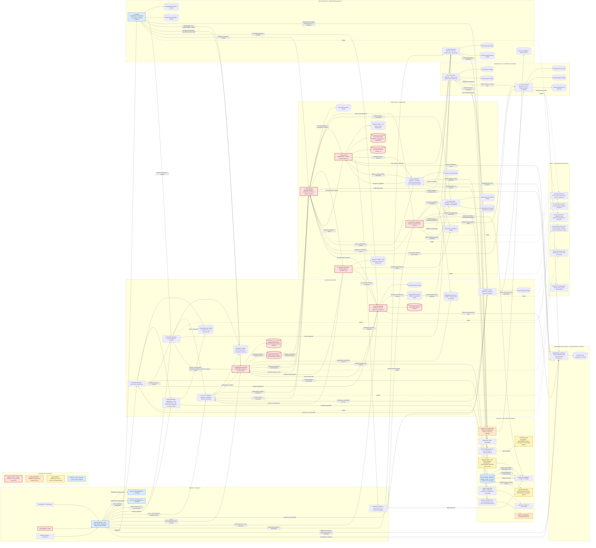

```mermaid
graph LR
%% SPOTTY - CUARTA ITERACION: CORRECCION SECURITY / RELIABILITY / SCALABILITY / SPEC
%% 16 servicios, almacenamiento logico y solo mecanismos con ROI relevante.
%% Servicios logicos NO implican despliegues independientes. Colas son recursos logicos.

subgraph CLIENTES["ACTORES Y ENTRADA"]
  PROF["PROFESOR - Web desktop"]
  EST["ESTUDIANTE - Mobile"]
  LEGCLIENT["CLIENTE LEGACY - Contratos v1"]
  GW["SPOTTY ENTRY - API / Web / Mobile - REPLICAS stateless bajo demanda"]
  WORKER["WORKER TECNICO - CPU / GPU - Solo ejecucion autorizada"]
  GW1["SPOTTY ENTRY REPLICA 1 - stateless"]
  GW2["SPOTTY ENTRY REPLICA 2 - stateless"]
  GW -->|"REPLICAS: enrutar peticion"| GW1
  GW -->|"REPLICAS: enrutar peticion"| GW2
  PROF --> GW
  EST --> GW
  LEGCLIENT --> GW
end

subgraph ACADEMICO["DOMINIO ACADEMICO"]
  AUTH["1. ACCESS SERVICE - Login, roles y autorizacion"]
  COURSE["2. COURSE SERVICE - Cursos, matriculas, docentes"]
  ACT["3. ACTIVITY SERVICE - Actividades, deadlines, rubricas versionadas"]
  CHAT["4. ACTIVITY CHAT SERVICE - Sesiones y propuestas editables"]
  SUB["5. SUBMISSION SERVICE - GitHub SHA, recepcion, version vigente"]
  REVIEW["12. GRADE REVIEW SERVICE - Revision, aprobacion y publicacion"]
  PROVISION["USER CREATION / REGISTER - POST /users/provision - alta institucional autorizada - sin signup publico"]
  AUTHDB[("AUTHORIZATION STORE - Usuario interno y rol, referencia IdP")]
  ACDB[("ACADEMIC STORE - Cursos / Matriculas / Actividades / Rubricas")]
  CHATDB[("CHAT SESSION STORE")]
  SUBDB[("SUBMISSION STORE - SHA / Timestamp / Historial / Vigencia")]
  SUBOUT[("SUBMISSION OUTBOX - Evento pendiente durable")]
  SNAP[("SUBMISSION ARTIFACT STORE - Snapshot SHA reproducible")]
  REVIEWDB[("GRADE REVIEW STORE")]
  GRADEOUT[("GRADE PUBLICATION OUTBOX - Publicacion durable")]
  PUBDB[("PUBLISHED GRADE STORE")]
  AUTH --> PROVISION
  PROVISION -->|"Alta JIT / sincronizacion institucional; validar rol y curso"| AUTHDB
  AUTH --> AUTHDB
  COURSE --> ACDB
  ACT --> ACDB
  CHAT --> CHATDB
  SUB --> SUBDB
  SUB -->|"Transaccion atomica registro + evento"| SUBOUT
  SUB -->|"Resguardar contenido del commit"| SNAP
  REVIEW --> REVIEWDB
  REVIEW -->|"Transaccion atomica nota + evento"| GRADEOUT
  REVIEW --> PUBDB
end

subgraph PROCESAMIENTO["EVALUACION Y EJECUCION"]
  ORQ["6. EVALUATION ORCHESTRATOR - Evaluaciones, intentos, estados, vigencia"]
  SCHED["7. EVALUATION SCHEDULER - Prioridad, justicia, asignacion"]
  CAP["8. SPOT CAPACITY SERVICE - Demanda CPU/GPU, Spot flexible, min 2 deseado, max 12/6"]
  EXEC["9. EXECUTION SERVICE - Pruebas, microVM, limites, evidencia"]
  CKPT["10. CHECKPOINT SERVICE - Persistencia y recuperacion de progreso"]
  GRADE["11. GRADING SERVICE - Nota provisional y confidence level"]
  EVALDB[("EVALUATION STATE STORE")]
  CPUQ[("CPU EVALUATION QUEUE - Programacion / Arquitectura")]
  GPUQ[("GPU EVALUATION QUEUE - IA")]
  QUEUEDB[("QUEUE STORE - Cola durable, tareas idempotentes")]
  CAPDB[("CAPACITY STATE STORE")]
  EVIDDB[("EXECUTION EVIDENCE STORE")]
  CKPTDB[("CHECKPOINT METADATA STORE")]
  CKPTSTORE[("CHECKPOINT STORAGE - Durable fuera de Spot")]
  GRADEDB[("GRADING STORE - Nota provisional / Confianza / Justificacion")]
  ORQ --> EVALDB
  SCHED --> QUEUEDB
  SCHED --> CPUQ
  SCHED --> GPUQ
  CAP --> CAPDB
  EXEC --> EVIDDB
  CKPT --> CKPTDB
  CKPT --> CKPTSTORE
  GRADE --> GRADEDB
end

subgraph INTELIGENCIA["ASISTENCIA LLM Y CONTROL DE TOKENS"]
  TOKEN["13. TOKEN BUDGET SERVICE - Cuotas, reserva atomica, conciliacion"]
  LLMA["14. LLM ACCESS SERVICE - Modelo y skill autorizados, solicitud, uso"]
  TPOL[("TOKEN POLICY STORE")]
  TBUD[("TOKEN BUDGET STORE")]
  TLED[("TOKEN RESERVATION LEDGER")]
  LCFG[("LLM CONFIG STORE")]
  LREQ[("LLM REQUEST STORE")]
  TOKEN --> TPOL
  TOKEN --> TBUD
  TOKEN --> TLED
  LLMA --> LCFG
  LLMA --> LREQ
end

subgraph INTEGRACION["NOTIFICACIONES Y COEXISTENCIA LEGACY"]
  NOTIF["15. NOTIFICATION SERVICE - Eventos, destinos, push, alertas 48h"]
  LEG["16. LEGACY COMPATIBILITY SERVICE - v1, propiedad, migracion, rollback"]
  NOTDB[("NOTIFICATION STORE")]
  DEVICE[("DEVICE REGISTRATION STORE")]
  LEGDB[("LEGACY DATABASE - Fuente historica")]
  MAPDB[("MIGRATION MAPPING STORE")]
  CTRLDB[("MIGRATION CONTROL STORE")]
  NOTIF --> NOTDB
  NOTIF --> DEVICE
  LEG --> MAPDB
  LEG --> CTRLDB
end

subgraph OBSERVACION["OBSERVABILIDAD MINIMA - SIN MICROSERVICIO NUEVO"]
  TEL["TELEMETRIA / FITNESS - Latencia P95/P99, edad cola, GPU, Spot, presupuesto"]
  TELDB[("METRICS AND TELEMETRY STORE")]
  TEL --> TELDB
end

subgraph EXTERNOS["SISTEMAS Y RECURSOS EXTERNOS"]
  IDP["IDENTITY PROVIDER - Identidad institucional"]
  GH["GITHUB - Codigo por commit SHA"]
  IMG["IMAGE REGISTRY - Bases por curso 3-5 GB - BOTTLENECK descargas en picos"]
  IMGCACHE[("CACHE-ASIDE - WORKER IMAGE CACHE - por hash / version; miss al registry")]
  AWS["AWS EC2 SPOT - Solo Spot; CPU/GPU diversificados - BOTTLENECK capacidad GPU escasa"]
  MICRO["MICROVM SANDBOX - Codigo no confiable"]
  LLM["EXTERNAL LLM PROVIDER - BOTTLENECK cuotas / concurrencia - Skill activity-draft-v1"]
  PUSH["EXTERNAL PUSH PROVIDER"]
  OLD["LEGACY ARCHITECTURE SYSTEM - POTENTIAL SPOF de cursos no migrados"]
  IDPCB["CIRCUIT BREAKER IDP - cortar dependencia ante falla, no omitir autenticacion"]
  LLMCB["CIRCUIT BREAKER LLM - fallar controlado y conservar reserva"]
  GITHUBCB["CIRCUIT BREAKER GitHub - suspender resolucion sin aceptar SHA sin respaldo"]
  OLD --> LEGDB
  AWS --> MICRO
  WORKER -->|"Aloja la ejecucion"| MICRO
  IMGCACHE -->|"CACHE-ASIDE MISS: descargar version"| IMG
  IMGCACHE -->|"CACHE-ASIDE HIT: reutilizar imagen"| MICRO
  IMG -->|"Guardar imagen verificada en host"| IMGCACHE
  IMGCACHE -->|"Preparar microVM"| MICRO
end

%% ENTRADA Y CONTROL DE ACCESO
GW -->|"POST /auth/login; /auth/logout"| AUTH
AUTH -->|"Validar identidad institucional"| IDPCB
IDPCB --> IDP
GW -->|"POST /users/provision - alta autorizada"| PROVISION
PROVISION -->|"Identidad comprobada"| IDPCB
AUTH -->|"Matricula / profesor asignado"| COURSE
GW -->|"Cursos y matriculas"| COURSE
GW -->|"Crear / editar / publicar actividad y rubrica"| ACT
GW -->|"Chat docente y propuestas"| CHAT
GW -->|"POST /activities/id/submissions; consultas"| SUB
GW -->|"Revision docente y notas publicadas"| REVIEW
GW -->|"Notificaciones propias / dispositivos"| NOTIF
GW -->|"/legacy/v1/*"| LEG
COURSE -->|"Curso y vinculacion"| ACT
ACT -->|"Configuracion y deadline"| SUB
AUTH -->|"Permisos academicos"| REVIEW

%% CHAT DOCENTE: PROPONE, NO PUBLICA
CHAT -->|"Profesor / curso autorizado"| AUTH
CHAT -->|"Reserva para generacion y refinamiento"| TOKEN
CHAT -->|"Generar/refinar propuesta"| LLMA
LLMA -->|"Propuesta estructurada"| CHAT
CHAT -->|"Propuesta y confirmacion docente"| ACT
ACT -->|"Nueva rubrica: solicitar recalificacion"| ORQ

%% ENTREGA: SHA, ULTIMA VALIDA Y ADMISION ASINCRONA
SUB -->|"Resolver SHA previo a confirmar"| GITHUBCB
GITHUBCB --> GH
SUB -->|"Verificar matricula"| COURSE
SUBOUT -->|"Despacho durable del evento de entrega"| ORQ
SUB -->|"Reentrega reemplaza version antigua"| ORQ
ORQ -->|"Consultar entrega y version"| SUB
ORQ -->|"Consultar rubrica versionada"| ACT

%% ORQUESTACION - PLANIFICACION - CAPACIDAD
ORQ -->|"Encolar evaluacion autorizada / recuperar"| SCHED
SCHED -->|"Perfil CPU / GPU y demanda"| CAP
CAP -->|"Solicitar, registrar o liberar capacidad"| AWS
CAP -->|"Workers y slots realmente disponibles"| SCHED
SCHED -->|"Seleccionar trabajo e intento"| ORQ
ORQ -->|"Intento / lease autorizado"| EXEC
SCHED -->|"Despachar al worker compatible"| WORKER
WORKER -->|"Ejecuta intento autorizado"| EXEC
CAP -->|"Aviso de interrupcion o perdida"| ORQ
AWS -->|"Interrupcion Spot: ~2 minutos"| CAP
CAP -->|"Instancia no asignable"| SCHED

%% EJECUCION SEGURA - CHECKPOINTS - RESULTADO
EXEC -->|"Recuperar snapshot inmutable"| SNAP
EXEC -->|"Imagen versionada desde cache-aside"| IMGCACHE
EXEC -->|"Ejecutar con limites CPU/GPU/RAM/tiempo"| MICRO
EXEC -->|"Guardar progreso y consultar restauracion"| CKPT
CKPT -->|"Ultimo checkpoint durable compatible"| EXEC
ORQ -->|"Solicitar progreso recuperable"| CKPT
EXEC -->|"Heartbeat / resultado por intento"| ORQ
ORQ -->|"Resultado tecnico vigente"| GRADE
GRADE -->|"Consultar evidencias por criterio"| EVIDDB
GRADE -->|"Criterios y ponderaciones"| ACT
GRADE -->|"Verificar entrega vigente"| SUB
GRADE -->|"Provisional, confianza, inconcluso"| REVIEW
REVIEW -->|"Consultar intento y vigencia"| ORQ
REVIEW -->|"Verificar ultimo SHA"| SUB

%% PRESUPUESTO LLM: IDENTIDAD LOGICA SE CONSERVA ENTRE INTENTOS
EXEC -->|"Reserva para evaluacion logica"| TOKEN
EXEC -->|"Analisis LLM autorizado"| LLMA
LLMA -->|"Verificar reserva y conciliar uso"| TOKEN
LLMA -->|"Solicitud validada / presupuesto"| LLMCB
LLMCB -->|"Skill / respuesta"| LLM
TOKEN -->|"Evaluation ID persiste entre intentos"| ORQ

%% EVENTOS ACADEMICOS Y ALERTAS
ORQ -->|"Estados relevantes"| NOTIF
GRADEOUT -->|"Evento durable de nota publicada"| NOTIF
SCHED -->|"Cola / espera / riesgo 48h"| NOTIF
CAP -->|"Escasez CPU/GPU"| NOTIF
NOTIF -->|"Push a destinatarios autorizados"| PUSH
GW -->|"REPLICAS: frontends stateless sin mantener sandboxes"| TEL
NOTIF -->|"Roles y matriculas"| COURSE

%% OBSERVABILIDAD: SOLO FLUJOS CRITICOS, NO CADA ENDPOINT
GW -->|"P95 admision y consulta"| TEL
SCHED -->|"Edad y profundidad de colas"| TEL
CAP -->|"Capacidad Spot real y memoria"| TEL
ORQ -->|"Intentos invalidos y recuperaciones"| TEL
TOKEN -->|"Consumo LLM y costo"| TEL
REVIEW -->|"Tiempo hasta publicacion 48h"| TEL

%% COMPATIBILIDAD LEGACY - UN PROPIETARIO POR CURSO/COHORTE
LEG -->|"Resolver propietario y mapeos"| COURSE
LEG -->|"STRANGLER PATTERN: ruta para cursos no migrados"| OLD
LEG -->|"STRANGLER: curso migrado dirigido a Spotty"| SUB
LEG -->|"Contratos v1 traducidos; una sola fuente de verdad"| SUB
LEG -->|"Resultados publicados migrados"| REVIEW
LEG -->|"Estado de evaluacion migrada"| ORQ

%% CAPACIDADES EVALUABLES DEL CASO (TRAZABILIDAD VISIBLE)
subgraph REQS["SPEC - CAPACIDADES MUST HAVE"]
  RF1["RF-001 a 004: login, alta institucional, roles, cursos y matriculas"]
  RF2["RF-005 a 010: actividades, rubricas, SHA y ultima entrega valida"]
  RF3["RF-012 a 024: cola CPU/GPU, Spot, aislamiento, checkpoint y resultados"]
  RF4["RF-025 a 030 y 041 a 043: nota provisional, confianza, revision, publicacion y push"]
  RF5["RF-034 a 039: chat docente, skill, confirmacion y tokens persistentes"]
  RF6["RF-046 a 050: contratos v1, historicidad, propietario y migracion"]
end
AUTH -. "cumple" .-> RF1
COURSE -. "cumple" .-> RF1
SUB -. "cumple" .-> RF2
ACT -. "cumple" .-> RF2
ORQ -. "cumple" .-> RF3
EXEC -. "cumple" .-> RF3
REVIEW -. "cumple" .-> RF4
GRADE -. "cumple" .-> RF4
CHAT -. "cumple" .-> RF5
TOKEN -. "cumple" .-> RF5
LEG -. "cumple" .-> RF6

%% PUNTOS CRITICOS Y PATRONES (NO IMPLICAN NUEVOS MICROSERVICIOS)
%% SPOF potencial: fuente institucional IdP y plataforma Legacy por su propietario historico.
%% BOTTLENECK: capacidad GPU Spot, proveedor LLM y descarga masiva de imagenes.
%% CB unicamente en dependencias externas; no transforma no-disponibilidad en exito.
%% CACHE-ASIDE imagenes por version; STRANGLER legacy; REPLICAS stateless del gateway.
%% Camino critico = entrega durable -> cola -> worker -> resultado -> publicacion.

subgraph GUIA["LEYENDA DE VALIDACION"]
  LCRIT["CRITICAL PATH - ROJO: recepcion, cola, ejecucion, nota oficial"]
  LSPOF["SPOF POTENCIAL - NARANJA: dependencia singular externa"]
  LBN["BOTTLENECK - AMARILLO: recurso escaso o descarga pesada"]
  LPAT["PATRON - AZUL: Strangler / Cache-Aside / Replicas"]
end
classDef critical fill:#ffe0e0,stroke:#b71c1c,stroke-width:3px,color:#222;
classDef spof fill:#ffe6cf,stroke:#d97706,stroke-width:2px,color:#222;
classDef bottleneck fill:#fff4bd,stroke:#b8860b,stroke-width:2px,color:#222;
classDef pattern fill:#dbebff,stroke:#2563eb,stroke-width:2px,color:#222;
class EST,GW,SUB,SUBDB,SUBOUT,ORQ,SCHED,CPUQ,GPUQ,EXEC,GRADE,REVIEW,PUBDB critical;
class IDP,OLD spof;
class AWS,LLM,IMG bottleneck;
class LEG,IMGCACHE,LPAT,GW,GW1,GW2 pattern;
class LCRIT critical;
class LSPOF spof;
class LBN bottleneck;

%% FITNESSES / UMBRALES PARA VALIDAR EN LA REVISION:
%% 960 entregas/30 min (stress 4800); API P95 entrega <= 2s.
%% CPU wait >5m, GPU wait >15m; RAM >75% por 3m; revisar cada 60s.
%% Pool activo: min 2 deseado, max 12 CPU / 6 GPU; Spot puede entregar 0.
%% Interrupcion Spot ~2m, objetivo de guardar progreso <=90s.
%% Heartbeat 15s, sospechoso 60s, reemplazo 120s tras invalidar lease.
%% Deadline calificacion 48h; costo Spot presupuestado 1500 USD/mes.
%% Los patrones NO incluidos (LB dedicado, cache API, CB en cada enlace)
%% no se justifican por la demanda observada y agregarian complejidad.
%% RF-011 historial visible y RF-040/044/045 funciones avanzadas son Nice to Have.
```

